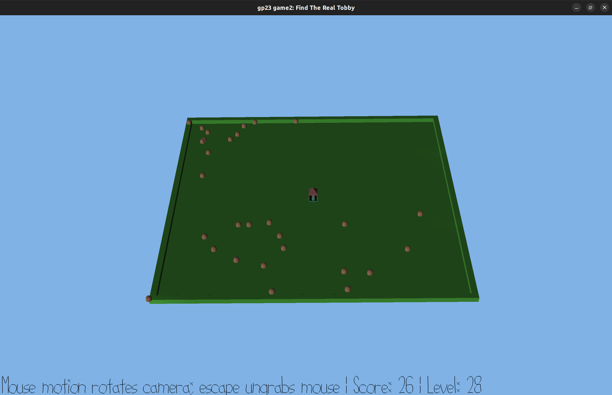

# Find the real Tobby

Author: Jiyoon Park

Design: "Find the Real Tobby" innovatively blends consistency in character movement with a strategy of distinguishing the real Tobby among fakes, creating a captivating and challenging gameplay concept. Players aim for the highest score by guiding the real Tobby through increasingly complex levels, offering a fresh and dynamic gaming experience.

Screen Shot:



## Setup:

### Method 1: Download from google drive

- download tobby.pnct, tobby.scene from [this link](https://drive.google.com/drive/folders/1aLQIXBgmqRze25DOkanEVNualbZ3mgqq?usp=sharing) to /dist folder

### Method 2: Make the files yourself

```
blender --background --python scenes/export-meshes.py -- scenes/tobby_m.blend dist/tobby.pnct
blender --background --python scenes/export-scene.py -- scenes/tobby_m.blend dist/tobby.scene
```

## How To Play:

Your goal is to move **the real Tobby** to his house and press the **space bar** to level up. Your final score is the score you have when you reach level 100.

## Rules:

- You can only use the up, down, right, left arrows to move Tobby.
- One more fake Tobby will be added if you find the Real Tobby.
- Once you press the space bar, your score will +1 if the real tobby is at the house, else you will -1.

### HotKey

- **up, down, right, left** : Moves Tobby.
- **space** : Checks if Real Tobby is home.

This game was built with [NEST](NEST.md).
